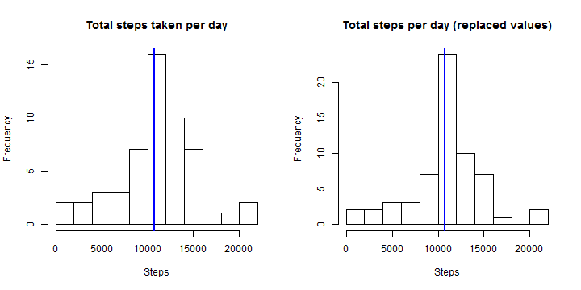
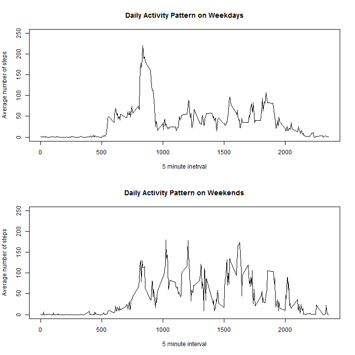

#Introduction


This assignment makes use of data from a personal activity monitoring device. This device collects data at 5 minute intervals through out the day. The data consists of two months of data from an anonymous individual collected during the months of October and November, 2012 and include the number of steps taken in 5 minute intervals each day.

This document presents the results of the Reproducible Research's Peer Assessment 1 in a report using a single R markdown document that can be processed by knitr and be transformed into an HTML file.

Through this report you can see that activities on weekdays mostly follow a work related routine, also we can find more intense activity in the little a spare time the employee has.

An important consideration is the fact that our data presents a t-student distribution (see both histograms), it means that the impact of imputing missing values with the mean has a good impact on our predictions without a significant distortion in the distribution of the data.


#Loading and processign the data

This assignment instructions request to show any code that is needed to loading and preprocessing the data, like to:

<ol>
<li>Load the data.</li>

<li>Process/transform the data into a format suitable for your analysis.</li>
</ol>

###Prepare the R environment!

Throughout this report when writing code chunks in the R markdown document, always use echo = TRUE so that someone else will be able to read the code.

First, we set echo equal a TRUE and results equal "hold" as global options for this document.

###Load required libraries & set echo = TRUE


```r
library(data.table)
```

```
## data.table 1.9.4  For help type: ?data.table
## *** NB: by=.EACHI is now explicit. See README to restore previous behaviour.
```

```r
library(knitr)
opts_chunk$set(echo=TRUE, results="hold")
```


###Set you working directory to where you stored the file

In order to find out where your current working directory is, you can use the getwd() command. 


```r
setwd("C:/Users/ebenoit/Documents/data science/05 Reproducible Research/Assignment1/repdata-data-activity")
```


###1.Load the data

Load the activity data-file into R. We want it to have headers, sepparate it by commas (since it is a CSV file).


```r
data <- read.csv("activity.csv", header=TRUE, sep=",", stringsAsFactors=FALSE)
```

###2.Process/transform the data into a format suitable for your analysis.

Convert the date field to Date class.


```r
data$date <- as.Date(data$date, format="%Y-%m-%d")
```

Check the data using the str() command.


```r
str(data)
```

```
## 'data.frame':	17568 obs. of  3 variables:
##  $ steps   : int  NA NA NA NA NA NA NA NA NA NA ...
##  $ date    : Date, format: "2012-10-01" "2012-10-01" ...
##  $ interval: int  0 5 10 15 20 25 30 35 40 45 ...
```

We can see that our second column which is date is formated correctly.


#What is the total number of steps taken per day?

<ol>
<li>Make a histogram of the total number of steps taken each day.</li>

<li>Calculate and report the mean and median total number of steps taken per day.</li>
</ol>


###Prepare the data

Create a array without the missing values. 


```r
data_without <- data[which(!is.na(data$steps)),]
```

The number of steps taken is measured in timeslots, 5-minute intervals, so in order to compute the total number of steps taken for each day we will aggregate the data by day.


```r
steps_per_day <- tapply(data_without$steps, data_without$date, sum)
```


###1.Make a Histogram.


```r
hist(steps_per_day,10, main = "Total steps taken per day", xlab = "")
```

 

###2.Calculate the mean and median.


```r
mean_without <- mean(steps_per_day)
mean_without
```

```
## [1] 10766.19
```


```r
median_without <- median(steps_per_day)
median_without
```

```
## [1] 10765
```


We see that the mean is 10766 and that the median is 10765.


#What is the average daily activity pattern?

<ol>
<li>Make a time series plot of the 5-minute interval (x-axis) and the average number of steps taken, averaged across all days (y-axis).</li>
<li>Which 5-minute interval, on average across all the days in the dataset, contains the maximum number of steps?</li>
</ol>

Calculate the mean of steps by intervals of 5-minutes and save the data in a variable called steps_per_interval and plot it.

###1. Make a time series plot


```r
steps_per_interval <- tapply(data_without$steps, data_without$interval, mean)
plot(y = steps_per_interval, x = names(steps_per_interval), type = "l", xlab = "5-Minute-Interval", 
    main = "Daily Activity Pattern", ylab = "Average number of steps")
```

 

###2.Which 5-minute interval, on average across all the days in the dataset, contains the maximum number of steps?

Finally, we find out that the interval with the maximum average number of steps throughout the days is 835 with 206.1698 steps.


```r
steps_per_interval[steps_per_interval==max(steps_per_interval)]
```

```
##      835 
## 206.1698
```


#Imputing missing values

##1.Calculate and report the total number of missing values in the dataset.
Calculate the total number of missing values.

Just steps:


```r
sum(is.na(data$steps))
```

```
## [1] 2304
```

Overall missing values:


```r
sum(is.na(data))
```

```
## [1] 2304
```

There's a total of 2304 missing values.

##2.Devise a strategy for filling in all of the missing values in the dataset. 


###Filling all the missing values in the dataset with the average value at the same interval across days.

To populate missing values, we choose to replace them with the mean value at the same interval across days. In most of the cases the median is a better centrality measure than mean, but in our case the total median is not much far away from total mean, and probably we can make the mean and median meet.

##3.Create a new dataset that is equal to the original dataset but with the missing data filled in.


```r
data_with <- data
data_with[which(is.na(data_with$steps)),1] <-steps_per_interval[as.character(data_with[which(is.na(data_with$steps)),3])]
```
Remember that our variable steps_per_interval is already populated by the 5 minutes interval means. What we just did is filling the missing values with the 5 minute interval means.

See that there are no missing values in the data left.


```r
sum(is.na(data_with))
```

```
## [1] 0
```

Perfect!!

##4. Make a histogram of the total number of steps taken each day and Calculate and report the mean and median total number of steps taken per day. Do these values differ from the estimates from the first part of the assignment? What is the impact of imputing missing data on the estimates of the total daily number of steps?

Let us visualize our findings and compare our results.


```r
steps_per_day_with <- tapply(data_with$steps, data_with$date, sum)
```


```r
par(mfrow=c(1,2)) #Plot 2 graphs in 1 row

hist(steps_per_day,10, main = "Total steps taken per day", xlab = "Steps") #Histogram without replaced values (first histogram)

abline(v=median(steps_per_day), col =4, lwd=2)

hist(steps_per_day_with, 10, main="Total steps per day (replaced values)", xlab="Steps") #Histogram with replaced values

abline(v=median(steps_per_day_with), col=4, lwd=2)
```

 

Report the mean and median from our new data.

```r
mean_with <- mean(steps_per_day_with)
mean_with
```

```
## [1] 10766.19
```

We find that our mean in the new data is 10766.19.


```r
median_with <- median(steps_per_day_with)
median_with
```

```
## [1] 10766.19
```

Our median with replaced values is 10766.19, the same as our mean.

Compare results:


```r
mean_with - mean_without
median_with - median_without
```

```
## [1] 0
## [1] 1.188679
```


As you can see, comparing with the calculations done in the first section of this document, we observe that while the mean value remains unchanged, the median value has shifted and virtual matches to the mean.

Since our data has shown a t-student distribution (see both histograms), it seems that the impact of imputing missing values has increase our peak, but it's not affect negatively our predictions.


#Are there differences in activity patterns between weekdays and weekends?

We do this comparison with the table with filled-in missing values.
<ol>
<li>Create a new factor variable in the dataset with two levels -- "weekday" and "weekend" indicating whether a given date is a weekday or weekend day.</li>
<li>Make a panel plot containing a time series plot of the 5-minute interval (x-axis) and the average number of steps taken, averaged across all weekday days or weekend days (y-axis).</li>
</ol>


###1.Creating the right data.

In this part of the assigment, we will create factor variable in the dataset with two levels - "weekday" and "weekend" indicating whether a given date is a weekday or weekend day.


```r
data_with$wd <- weekdays(data_with$date)

data_with$fwd <- as.factor(c("weekend","weekday"))

data_with[data_with$wd == "domingo" | data_with$wd == "sabado",5] <- factor("weekend") #Weekend also dependant on language format.

data_with[!(data_with$wd == "domingo" | data_with$wd == "sabado"),5] <- factor("weekday") #Weekday also dependant on language format
```


Now we will create two aggregated arrays for the total number of steps taken per 5-minute time interval for weekdays and weekends, and make a graph in order to compare and see if there is any difference.


```r
data_with_we <- subset(data_with, fwd == "weekend")

data_with_wd <- subset(data_with, fwd == "weekday")

steps_per_day_we <- tapply(data_with_we$steps, data_with_we$interval, mean)

steps_per_day_wd <- tapply(data_with_wd$steps, data_with_wd$interval, mean)
```


###2. Making a time series plot.


```r
par(mfrow=c(2,1))

plot(y = steps_per_day_wd, x = names(steps_per_day_wd), type = "l", xlab = "5 minute inetrval", main = "Daily Activity Pattern on Weekdays", ylab = "Average number of steps", ylim = c(0,250))

plot(y = steps_per_day_we, x = names(steps_per_day_we), type = "l", xlab = "5 minute interval", main = "Daily Activity Pattern on Weekends", ylab = "Average number of steps", ylim = c(0,250))
```

 

From the two graphs, we can clearly see that the distribution throughout the day is quite different than in weekends. First of all, the individual from whom the measurements were taken, seem to wake up at least one hour later at weekends. Another interesting finding is that there is a huge amount of steps taken on weekdays, possibly while going to work or working out, which does not appear on Saturdays or Sundays. Generally, the whole weekend seems to be more evenly distributed with no huge deviations during hours when a normal person is expected to be awake and active. But, we can observe on average more steps during a weekend day, than on a "working" day. So, this individual is currently employed (or a volunteer), he/she does not take the car to and from work. As far as his/her job is concerned, he/she is not a teacher (as my teacher wife claims) or a waiter.

Please, once more, keep in mind that the x-axis point labels are the names of the intervals in the dataset. The coding of the interval names is such, so that e.g. 500 should be considered as 5:00am and 1000 as 10:00am, and so on. So, one can consider the x-axis as a full 24-hour-day starting from midnight and ending at the next midnight hour.
